# K-means

This is third assignment of Introduction to Machine Learning (COMP 462) course. In this assignment, I implement  K-means clustering algorithm to cluster given three different datasets.

## Datasets
The dataset files contain features (in 2D) and class labels. In this assignment, I
didn’t use class labels since K-means is an unsupervised algorithm and does not
need class labels. Scatter plot of the datasets given in Figure 1.

 
 
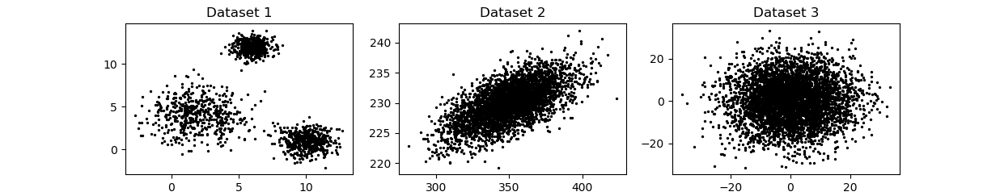 
  Figure 1: Three datasets.

## K-means Algorithm
K-means clustering is a simple and popular type of unsupervised machine learning algorithm, which is used on unlabeled data. 
The goal of this algorithm is tofind groups in the data, with the number of groups represented by the variable
*K*. The algorithm works iteratively to assign each data point to one of *K* groups according to provided features similarity.
Algorithm steps for K-means given as following.

1. Randomly pick *K* observations and set them as initial cluster centers
2. Iterate until cluster assignments stop changing: 
    * For each of the *K* clusters, compute the cluster centroid. The *k*th clustercentroid is the vector of the p feature means for the observations in the *k*th cluster.
    * Assign each observation to the cluster whose centroid is closest (where closest
is defined using Euclidean distance).

When N is number of samples and K is number of clusters, K-means algorithm try to minimize objective function which given as following.

 

## Clustering Results
I implement K-Means class for algorithm and cluster three given dataset with
following configurations:
* Dataset1: k=3, k=7
* Dataset2: k=2, k=5
* Dataset3: k=3, k=8

Clustering results for each configuration given as follows. 
 
 
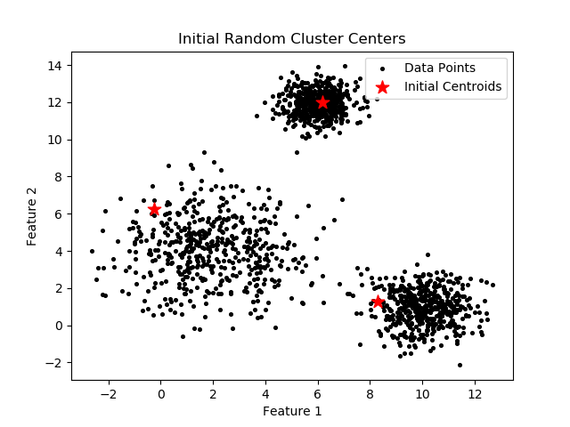 
  Figure 2: Change of centroids place for first dataset when k = 3.

 
 
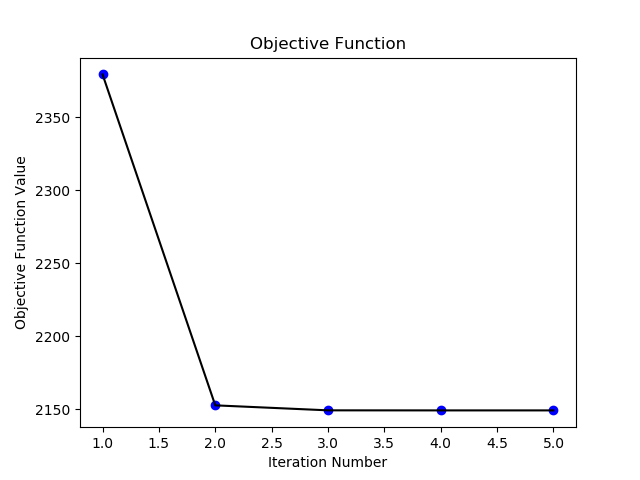 
  Figure 3: Objective function value vs iteration number (Dataset1, k=3).

 
 
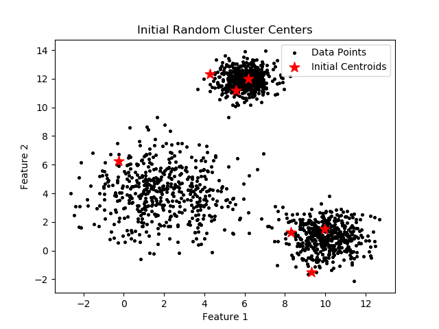 
  Figure 4: Change of centroids place for first dataset when k = 7.

 
 
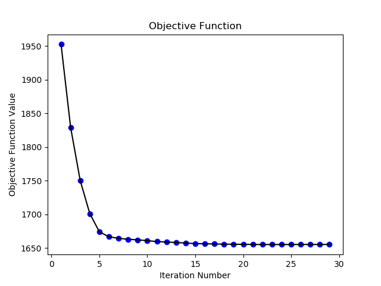 
  Figure 5: Objective function value vs iteration number (Dataset1, k=7).

 
 
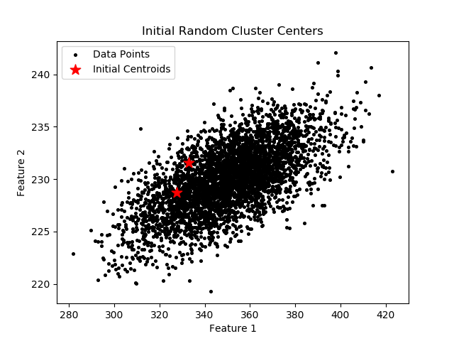 
  Figure 6: Change of centroids place for second dataset when k = 2.

 
 
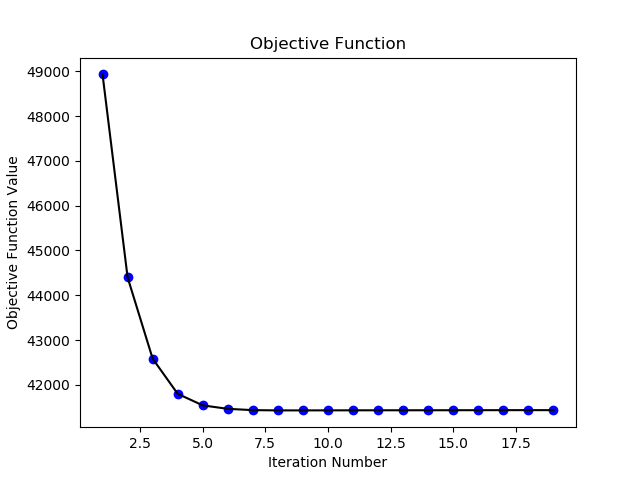 
  Figure 7: Objective function value vs iteration number (Dataset2, k=2).

 
 
 
  Figure 8: Change of centroids place for second dataset when k = 5.

 
 
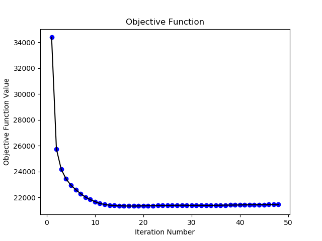 
  Figure 9: Objective function value vs iteration number (Dataset2, k=5).

 
 
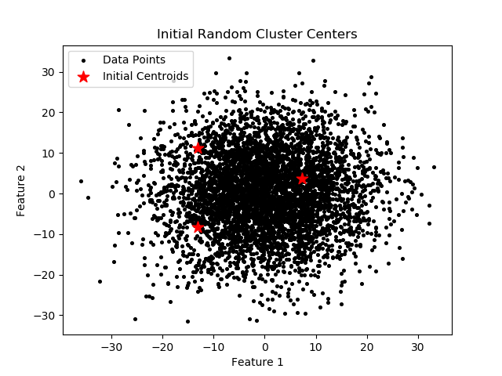 
  Figure 10: Change of centroids place for third dataset when k = 3.

 
 
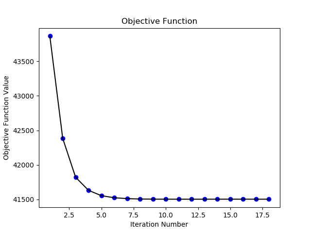 
  Figure 11: Objective function value vs iteration number (Dataset3, k=3).

 
 
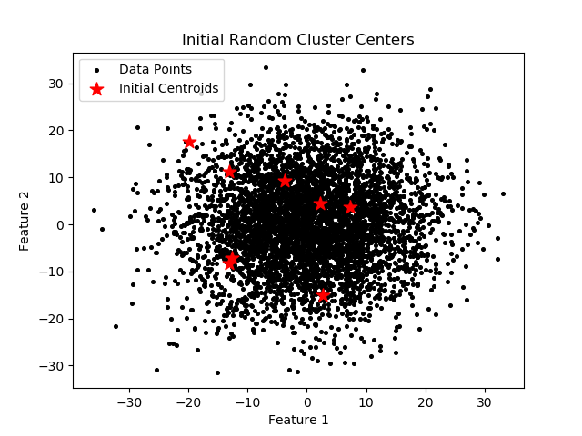 
  Figure 12: Change of centroids place for third dataset when k = 8.

 
 
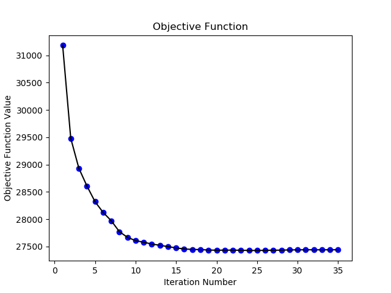 
  Figure 13: Objective function value vs iteration number (Dataset3, k=8).

